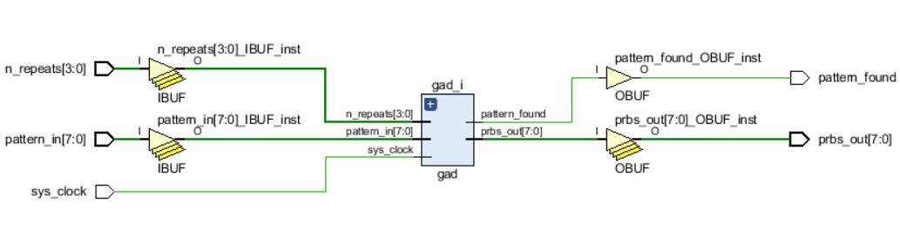

# FPGA Targeted Design: PRBS-15 Block and Pattern Detector

This project involves the design of a Pseudo-Random Binary Sequence (PRBS-15) generator and a Pattern Detector using Verilog.

## Table of Contents
- [Project Description](#project-description)
- [Deliverables](#deliverables)
- [Design Overview](#design-overview)
    - [PRBS-15 Block](#prbs-15-block)
    - [Pattern Detector](#pattern-detector)
    - [Top Module](#top-module)
    - [Serial to Parallel Converter](#serial-to-parallel-converter)
- [Testbenches](#testbenches)
- [Bitstream Generation](#bitstream-generation)

## Project Description

This project provides an FPGA-targeted design in Verilog, containing:
- A PRBS-15 block that outputs a custom pseudo-random sequence.
- A pattern detector block that identifies when a specific pattern repeats correctly n times.
- A serial-to-parallel module to handle resource limitations on the FPGA.

**Expected Wave Form in Success Case**

**Expected Wave Form in failed Case**

## Deliverables

1. **Custom PRBS-15 Block**:
   - Takes a 4-byte pattern as input.
   - Outputs these 4 bytes after each other n times.
   - Implements a custom PRBS equation with XOR of bit 13 and bit 14.
   
2. **Pattern Detector**:
   - FSM-based.
   - Detects if the pattern is correctly repeated n times.
   - Raises a flag once the pattern is found.
   
3. **Serial to Parallel Converter**:
   - Handles limited FPGA resources by receiving 8-bit inputs serially and converting them into a 32-bit parallel output.
   
4. **Top Module**:
   - Integrates the PRBS-15, Pattern Detector, and Serial-to-Parallel blocks.
   
5. **Testbenches**:
   - Provided for each block and the top-level module to validate the functionality.

6. **Constraint File FPGA**
   - constraints that your board places on designs using it 
   - specific interfaces wired up to specific pins.

7. **Bitstream**:
   - The overall system is synthesized and implemented on the target FPGA using Xilinx Vivado.

## Design Overview

### PRBS-15 Block

This module generates a pseudo-random binary sequence using a custom PRBS-15 equation. It accepts a 32-bit input pattern and repeats it n times before applying a shift-left operation with XORing of bit 13 and bit 14 to generate the PRBS sequence.

#### Ports:
- **clk**: Clock signal.
- **rst_n**: Active-low reset signal.
- **pattern_in**: 32-bit input pattern.
- **n_repeats**: 8-bit input specifying the number of times to repeat the pattern.
- **prbs_out**: 8-bit output PRBS sequence.
   
#### Internal Registers:
- **pattern_counter**: Count the patterns to reach **n_repeats**.
- **byte_counter**: Count the 4 Bytes for every pattern.

### Pattern Detector

This block uses a finite state machine (FSM) to detect if a given pattern is repeated n times in the input data stream. The FSM transitions between IDLE, MATCHING, and FOUND states to ensure that the pattern is correctly detected.

#### Ports:
- **clk**: Clock signal.
- **rst_n**: Active-low reset signal.
- **data_in**: 8-bit input data stream from the PRBS block.
- **pattern**: 32-bit input pattern to detect.
- **n_repeats**: 8-bit input specifying the number of times the pattern should repeat.
- **pattern_found**: Output flag that is asserted when the pattern is detected.

### Serial to Parallel Converter

To account for FPGA resource constraints, this module allows serial data input of 8 bits, which are then converted into a 32-bit parallel output. The serial-to-parallel converter accumulates data over multiple cycles before outputting the full 32-bit data.

#### Ports:
- **clk**: Clock signal.
- **rst_n**: Active-low reset signal.
- **data_serial**: 8-bit serial input.
- **data_parallel**: 8-bit parallel output.
- **finish**: Signal asserted once the data has been completely received and converted to parallel.

### Top Module

The top module integrates the PRBS-15 block, Pattern Detector, and Serial to Parallel Converter. It connects the prbs_out from the PRBS block to the data_in of the Pattern Detector, ensuring that the detector checks the PRBS sequence for repeated patterns.

#### Ports:
- **clk**: Clock signal.
- **rst_n**: Active-low reset signal.
- **pattern_in**: 32-bit input pattern.
- **n_repeats**: 8-bit input specifying the number of repeats.
- **pattern_found**: Output flag indicating if the pattern was detected.

## Testbenches

Testbenches are provided for:
1. **PRBS-15 Block**: Validates the PRBS output for different input patterns and repeat counts.
2. **Pattern Detector**: Tests whether the detector correctly identifies patterns.
3. **Serial to Parallel Converter**: Ensures the serial data is correctly converted to parallel.
4. **Top Module**: Verifies the integration of the PRBS-15, Pattern Detector, and Serial-to-Parallel blocks.

### **1. `Top_FPGA_TB`**

The `Top_FPGA_TB` testbench verifies the functionality of the top FPGA design, which integrates the PRBS-15 block, pattern detector, and the serial-to-parallel converter.

#### Test Cases:

- **Reset Test (Test 1)**:
  - The system is reset twice to check if the reset mechanism works as intended.
  - A random 8-bit pattern is applied and repeated 3 times to check the PRBS generation and detection.
  
- **Pattern Detection Test with Different Repeats (Test 2)**:
  - The test checks the detection of a pattern repeated a different number of times.
  - The pattern is changed and repeated 5 times to validate the flexibility of the pattern detector.
  
- **Extended Repeat Test Without Reset (Test 3)**:
  - In this test, the system is run without resetting between tests.
  - The repeat count is set to 7, and the pattern is adjusted dynamically to ensure that the pattern detector works without requiring resets between patterns.

The output includes:
- **Pattern** (`patern`): Displays the current 32-bit pattern.
- **Finish Signal** (`finsh`): Indicates when the serial-to-parallel conversion is complete.
- **Pattern Counter** (`counter_patern`): Tracks how many patterns have been processed.
- **Repeats** (`rep`): Indicates how many times the pattern has been repeated.

**Top_FPGA_TB**

### **2. `Top_TB`**

The `Top_TB` testbench validates the top module integration, focusing on the PRBS-15 block and the pattern detector blocks, without the serial-to-parallel converter.

#### Test Cases:

- **Initial Reset Test**:
  - The system is reset, and a random 32-bit pattern is generated and repeated 3 times. This test ensures proper initialization and basic functionality.
  
- **Second Pattern Generation (Test 1)**:
  - A second random 32-bit pattern is applied and repeated 2 times. This test checks if the pattern detector can handle multiple patterns consecutively.
  
- **Repeat Pattern with Reset (Test 2)**:
  - After resetting the system, a new 32-bit random pattern is applied and repeated 3 times. The test verifies that resetting clears the system and prepares it for the next pattern.
  
- **Dynamic Pattern Test (Test 3)**:
  - The test applies a random pattern that is incremented by 1 to ensure the PRBS-15 generator and pattern detector respond correctly to changing input patterns.
  
- **Final Random Pattern Test (Test 4)**:
  - A final random pattern is generated to confirm the system’s functionality after multiple changes in pattern and repeats.

The outputs include:
- **Pattern Found** (`pattern_found1`, `pattern_found2`): Indicates whether the pattern was successfully detected by the first and second pattern detectors.
- **PRBS Output** (`prbs_out1`, `prbs_out2`): Outputs the PRBS sequences generated by the two PRBS-15 blocks.

**Top_TB**

## Bitstream Generation

For FPGA deployment, the bitstream generation includes the following considerations:
- A **serial-to-parallel converter** is introduced to handle 8-bit serial inputs in environments with limited resources.
- The overall system is synthesized and implemented on the target FPGA using Xilinx Vivado.
  
**Block diagram**

  

**Synthesis**

  

**Timing Analysis Results**

  

**Power analysis**

  

**Placement**

  

**Utilization**

  
--- 
